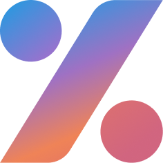
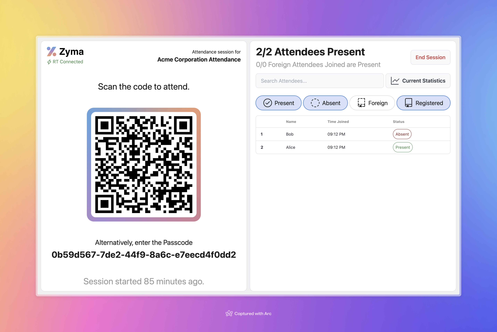
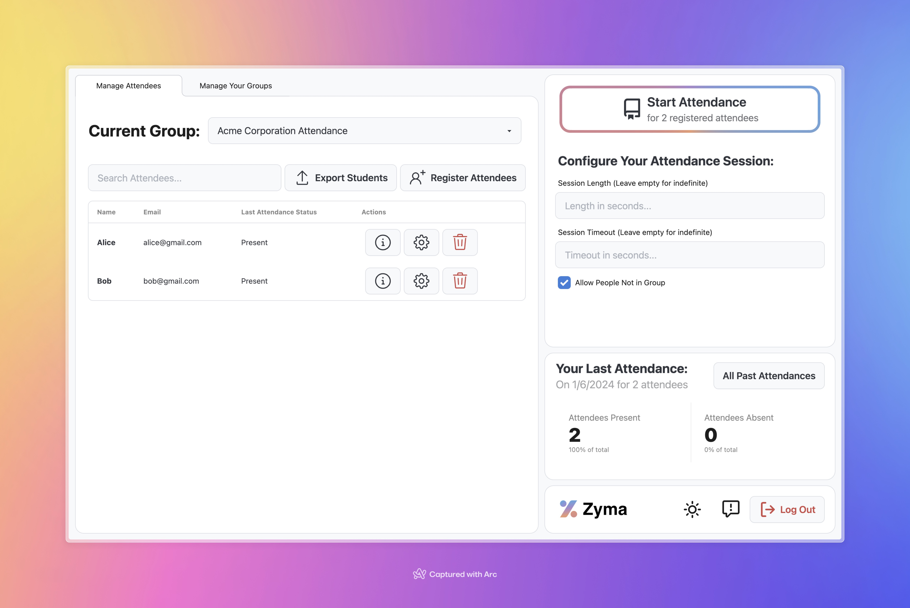

#  Zyma

**_Simply Present_**

Visit at [https://zyma.vercel.app](https://zyma.vercel.app). Hosted proudly on Vercel.

_Attendance Page: Have guests join, just by scanning the code._

Zyma is an attendance tracker built for the 21st century. Easy to use, it's built for everything from small group meetings to large event.

> Zyma was originally [built in a 12-hour hackathon](https://github.com/EvanZhouDev/codeforcause-hackathon)!

## Gallery

> Here's what Zyma can do

  
Host Dashboard Screenshot

_Host Dashboard: Create and host attendance for Groups_

  
Student Dashboard Screenshot

_Student Dashboard: Join Attendance and manage your groups here._

## FAQ

> I have a question!

### How do I contribute?

See our [contributing guide](./CONTRIBUTING.md).

TL;DR: Submit a PR of something you think will be useful!

### Why the name?

The Chinese for "here?" (as in "are you here?") is 在吗, which can be romanized to "zaì mā" using [pinyin](https://en.wikipedia.org/wiki/Pinyin). "Zai ma" (removing accents) can be re-written to the cooler-looking but phonetically equivalent "Zyma".

